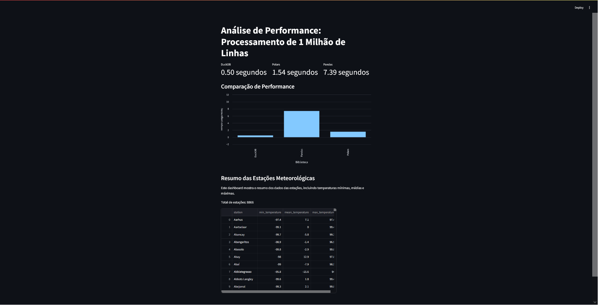

# Análise de Performance: Processamento de 1 Milhão de Linhas

Este projeto compara diferentes bibliotecas de processamento de dados em Python, processando um arquivo de medições de temperatura com 1 milhão de linhas.

## Dashboard

## Estrutura do Dado
- Arquivo: `measurements.txt`
- Formato: CSV com separador ';'
- Colunas: station (texto), measure (número decimal)
- Número de linhas: 1.000.000 (1 milhão)
- Número de estações únicas: 8.866

## Resultados de Performance

| Biblioteca | Tempo de Processamento | Observações |
|------------|----------------------|-------------|
| DuckDB     | 0.50 segundos       | Muito eficiente, salva resultado em Parquet |
| Polars     | 1.54 segundos       | Excelente para processamento em memória |
| Pandas     | 7.39 segundos       | Processamento em chunks de 100k linhas |

## Características de Cada Implementação

### DuckDB
- Implementação mais rápida
- Usa SQL para processamento
- Salva resultado em formato Parquet
- Excelente para queries analíticas

### Polars
- Segunda implementação mais rápida
- Processamento em memória
- Sintaxe similar ao Pandas
- Excelente para agregações

### Pandas
- Processamento em chunks de 100k linhas
- Familiar para usuários de Python
- Mais lento, mas com menor uso de memória
- Bom para processamento incremental

### Instale as dependências
pip freeze > requirements.txt